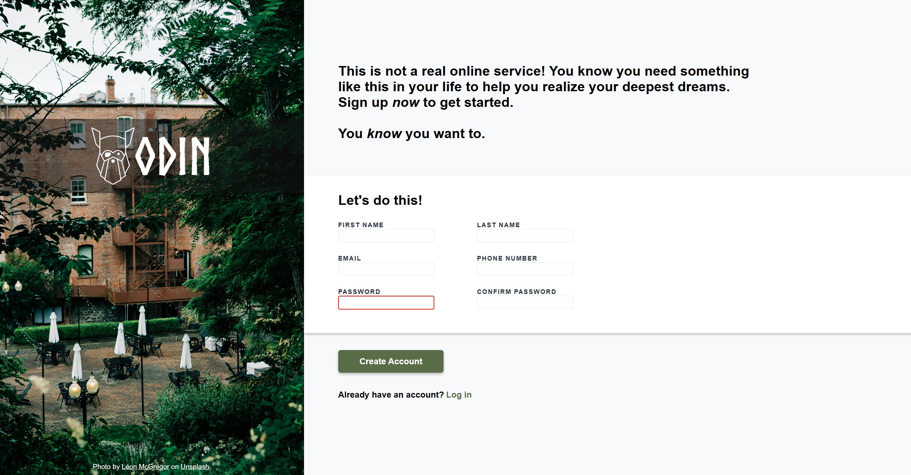
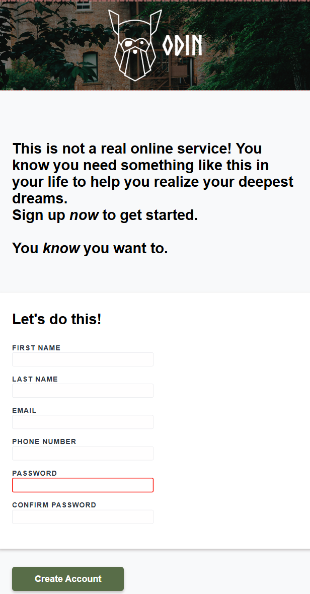

# Odin Sign-Up Form

## Description

A responsive sign-up form created as part of [The Odin Project](https://www.theodinproject.com/) curriculum. This project demonstrates modern form design with client-side validation, responsive layout techniques, and attention to UX details.

## Key Features

- **Responsive Design**: Adapts seamlessly from mobile to desktop views
- **Form Validation**: Client-side validation with visual feedback
- **Modern UI Elements**:
  - Custom input focus states
  - Password validation styling
  - Subtle shadows and transitions
- **Accessibility**: Semantic HTML and proper labeling
- **Visual Design**:
  - Full-bleed background image
  - Custom Norse Bold font for branding
  - Color scheme matching design specs

## Technologies Used

- **HTML5**: Semantic structure and form elements
- **CSS3**:
  - Flexbox for layout
  - Media queries for responsiveness
  - Custom properties (CSS variables)
  - Pseudo-classes for interactive states
- **Design Principles**:
  - Mobile-first approach
  - Visual hierarchy
  - Consistent spacing system

## Live Demo

[View Project Live](https://orianaland.github.io/Sign-up-Form/)

## Screenshots

### Desktop View



### Mobile View



## Installation

To run locally:

```bash
git clone https://github.com/yourusername/sign-up-form.git
cd sign-up-form
open index.html
```
